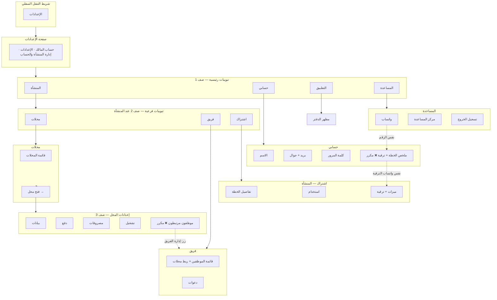
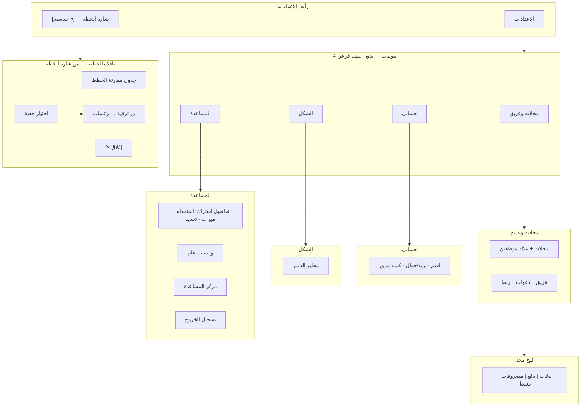
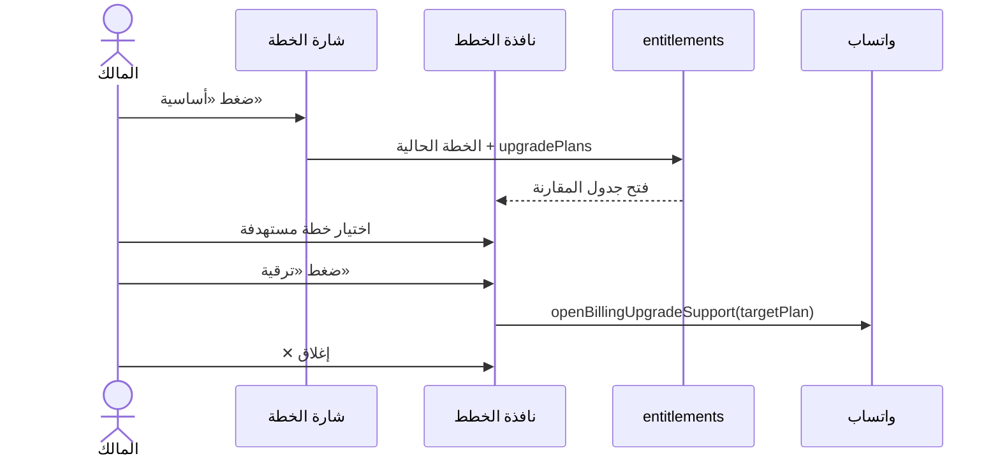
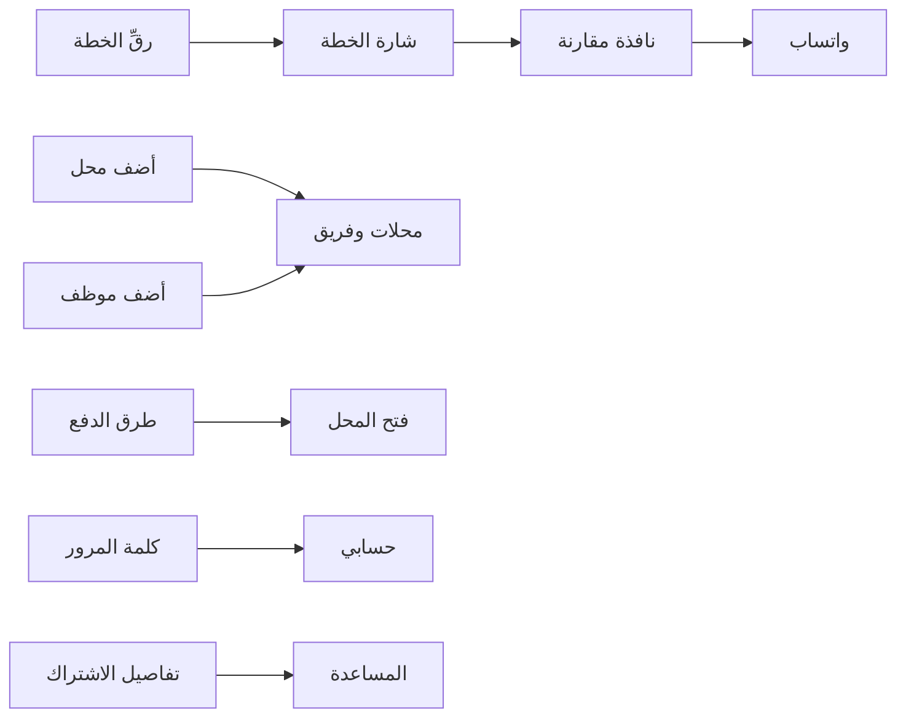
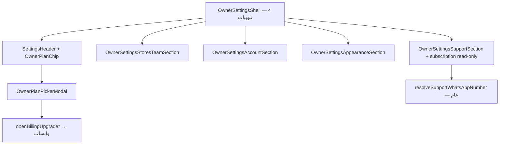

# خطة معلومات إعدادات المالك (IA) — معتمدة

> **الحالة:** معتمدة من مالك المنتج — **2026-06-19**  
> **السياق:** مراجعة UX لقسم الإعدادات بعد PRs #329–#331 (حسابي، اشتراك، دعم واتساب)  
> **التنفيذ:** دفعة واحدة — **لا نشر على `main`** إلا بطلب صريح «جاهز للايف»  
> **القيود:** احترام `docs/APPROVED_UI_BASELINE.md` — تغييرات تنظيمية (تبويبات/قوائم) بموافقة صريحة؛ لا تغيير ألوان/هوية بصرية بدون موافقة

---

## ملخص القرارات (محدّث 2026-06-19)

| # | القرار |
|---|--------|
| 1 | **4 تبويبات مسطّحة** — **بدون** صف تبويبات فرعي |
| 2 | **تبويب 1 — محلات وفريق** — دمج المحلات + الفريق + الدعوات + ربط موظف↔محل |
| 3 | **تبويب 2 — حسابي** — هوية + أمان فقط؛ **بدون** اشتراك |
| 4 | **تبويب 3 — الشكل** — مظهر الدفتر (بدل «التطبيق») |
| 5 | **تبويب 4 — المساعدة** — تفاصيل الاشتراك (استخدام، ميزات، تجديد) + واتساب عام + مركز مساعدة + خروج |
| 6 | **شارة الخطة بجانب الإعدادات** — تعرض اسم الخطة الحالية (مثل «أساسية»)؛ الضغط يفتح **نافذة مقارنة الخطط** |
| 7 | **نافذة الخطط** — جدول مقارنة + اختيار خطة + زر «ترقية» → واتساب؛ زر ✕ للإغلاق |
| 8 | **حذف المكرر** — staff panels في المحل؛ plan panel في حسابي؛ صفّي التبويبات 4+3 |
| 9 | **تنظيف legacy** — `OwnerSettingsHomeSection` / مسار `home` |

---

## المخطط: الوضع الحالي (قبل)



### مشاكل الوضع الحالي

- **7 أزرار تبويب** ظاهرة دفعة واحدة تحت «المنشأة»
- **3 مستويات** عند فتح محل (رئيسي → فرعي → محل)
- **علاقة موظف↔محل** مُدارة من الفريق **ومُعرضة** من المحل (للقراءة) ثم إعادة توجيه
- **الاشتراك** في «المنشأة → اشتراك» **و** «حسابي»
- **واتساب/ترقية** من 3 مسارات

---

## المخطط: الهدف الجديد (بعد) — 4 تبويبات + شارة الخطة



### تدفق نافذة الخطط (Plan Picker Modal)



---

## مو spec — شارة الخطة + النافذة

### شارة الخطة (Plan Chip)

| البند | المو spec |
|-------|-----------|
| **الموضع** | بجانب عنوان «الإعدادات» في رأس صفحة الإعدادات |
| **النص** | `pickLocalizedPlanName(entitlements)` — مثل «أساسية» أو «تجربة مجانية» |
| **السلوك** | ضغطة → فتح `OwnerPlanPickerModal` |
| **التحميل** | skeleton أو إخفاء حتى `entitlements` |
| **التجريبي** | badge «تجريبي» بجانب الاسم إن `isTrialPlan` |

### نافذة مقارنة الخطط (`OwnerPlanPickerModal`)

| البند | المو spec |
|-------|-----------|
| **الإغلاق** | زر ✕ + النقر على الخلفية + Escape |
| **المحتوى** | جدول مقارنة: اسم الخطة، السعر، حد المحلات، حد الموظفين، أبرز الميزات |
| **الخطط** | الحالية (مميّزة «خطتك») + `upgradePlans`؛ للتجريبي: الخطط المدفوعة المتاحة |
| **الاختيار** | `selectedPlanCode` — صف/بطاقة واحدة |
| **زر «ترقية»** | أسفل الجدول؛ **معطّل** حتى اختيار خطة ≠ الحالية |
| **عند «ترقية»** | `openBillingUpgradeSupport` / `openBillingUpgradeToPaidSupport` → واتساب |
| **مصدر البيانات** | `useOrganizationEntitlements` — لا API جديد في الدفعة الأولى |

### wireframe نصي

```text
┌─────────────────────────────────────────┐
│  مقارنة الخطط                      [✕] │
├─────────────────────────────────────────┤
│  ┌─────────┬─────────┬─────────┐       │
│  │ أساسية ✓│  نمو   │  أعمال  │       │
│  │ 1 محل   │ 3 محلات │ 10 محلات│       │
│  │ 2 موظف  │ 5 موظفين│ 20 موظف │       │
│  │ 99 ر.س  │ 199 ر.س │ 399 ر.س │       │
│  └─────────┴─────────┴─────────┘       │
│         (○) اختيار «نمو» للترقية        │
├─────────────────────────────────────────┤
│  [        ترقية — طلب عبر واتساب        ]│
└─────────────────────────────────────────┘
```

### فصل المسارات (بدون تكرار)

| المسار | الغرض |
|--------|--------|
| **شارة → نافذة → ترقية** | اختيار خطة + طلب ترقية (واتساب بسياق الخطة) |
| **المساعدة → اشتراك** | قراءة: أيام متبقية، استخدام، ميزات |
| **المساعدة → واتساب** | دعم عام |
| **حسابي** | بدون اشتراك |

---

## تدفق المستخدم (User Flow)



---

## خريطة المحتوى (Content Map)

| القسم | المحتوى | يُحذف |
|-------|---------|--------|
| **شارة الخطة** | اسم الخطة + فتح نافذة المقارنة | — |
| **نافذة الخطط** | جدول + اختيار + ترقية → واتساب | أزرار ترقية مكررة في حسابي/اشتراك |
| **محلات وفريق** | محلات؛ فريق؛ دعوات؛ ربط | تبويب «فريق»؛ staff في المحل |
| **فتح محل** | بيانات، دفع، مصروفات، تشغيل | موظفون مرتبطون |
| **حسابي** | اسم؛ بريد/جوال؛ كلمة مرور | `OwnerSettingsAccountPlanPanel` |
| **الشكل** | مظهر الدفتر | تبويب «التطبيق» |
| **المساعدة** | اشتراك (قراءة)؛ واتساب؛ مساعدة؛ خروج | — |

---

## سجل حذف المكرر (منفذ)

### UI

- [x] إزالة تبويب فرعي **«فريق»** — دمج المحتوى تحت **«محلات وفريق»**
- [x] إزالة **`OwnerSettingsAccountPlanPanel`** من `OwnerSettingsAccountSection`
- [x] إزالة **`OwnerSettingsStoreStaffPanel`** ومسار `staff` من overview المحل
- [x] إزالة كتلة **«الموظفون المرتبطون»** + زر **«إدارة الفريق والصلاحيات»** من تبويب «تشغيل» في `OwnerSettingsStoreFlattenedPanel`
- [x] إزالة **صفّي التبويبات** (4+3) → **4 تبويبات مسطّحة**
- [x] **شارة الخطة** + **`OwnerPlanPickerModal`** في رأس الإعدادات
- [x] إزالة أزرار ترقية مكررة من `OwnerSettingsSubscriptionSection` (الترقية من النافذة فقط)
- [x] rename تبويب «التطبيق» → **«الشكل»**
- [x] نقل تفاصيل الاشتراك (قراءة) إلى تبويب **«المساعدة»**

### تنقل / كود

- [x] تحديث `owner-settings-tab-navigation.ts` — 4 tabs: `stores-team`, `account`, `appearance`, `support`
- [x] مكوّنات `OwnerPlanChip` و`OwnerPlanPickerModal` تحت `src/features/billing/client/`
- [x] `initialSettingsSection === "home"` يوجّه إلى `stores-team`
- [x] توحيد رجوع الأقسام عبر خريطة التنقل الحالية
- [x] تقييم **`OwnerSettingsHomeSection`**: أبقي كمسار توافق داخلي، بينما القشرة المبوّبة تبدأ من `stores-team`
- [x] تحديث اختبارات `owner-settings-tab-navigation.test.ts` واختبار smoke لحدود وحدات الإعدادات

### ما لا يُمس

- APIs الفوترة والصلاحيات — لا تغيير عقد
- إعدادات المحل التشغيلية (دفع، مصروفات، closeoutAlert، …)
- سياسة **صفر مراجعة** للتقفيلات
- `GET /api/v1/owner/account` — يبقى لـ «حسابي»

---

## مخطط المكوّنات (Target Components)



---

## مقارنة سريعة

| المعيار | قبل | بعد |
|---------|-----|-----|
| تبويبات ظاهرة (المنشأة) | 7 | 0–1 (قائمة) |
| أماكن «الاشتراك/ترقية» | 2 | 1 |
| أماكن إدارة موظف↔محل | 2 (+ عرض في المحل) | 1 |
| عمود التنقل عند المحل | 3 مستويات | 2 (قائمة → محل) |
| حسابي | 4 بطاقات | 2 منطقيتان (هوية + أمان) |

---

## حالة التنفيذ

1. ✅ **هيكل القشرة** — قائمة/تبويبات + navigation منفصلة.
2. ✅ **دمج محلات وفريق** — `OwnerSettingsStoresTeamSection` ينسق القسمين دون تكرار منطق العرض.
3. ✅ **تنظيف المحل** — واجهة المحلات مستقلة ولا تكرر إدارة الفريق.
4. ✅ **تنظيف حسابي** — الحساب والاشتراك قسمان مستقلان.
5. ✅ **حدود الوحدات** — اختبار smoke يحمل كل قسم مباشرة، مع lint وtypecheck والاختبارات والبناء في CI.

---

## مراجع ملفات (الوضع الحالي)

| ملف | دور |
|-----|-----|
| `src/components/prototype-runtime/owner-settings-tabbed-shell.tsx` | القشرة الحالية والتبديل بين التبويبات |
| `src/components/prototype-runtime/owner-settings-tab-primitives.tsx` | تعريف عناصر التبويبات |
| `src/components/prototype-runtime/owner-settings-tab-navigation.ts` | mapping بين القسم والتبويب |
| `src/components/prototype-runtime/owner-settings-section-views.tsx` | التوجيه وتجميع الأقسام فقط |
| `src/components/prototype-runtime/owner-settings-account-section.tsx` | حساب المالك والأمان |
| `src/components/prototype-runtime/owner-settings-home-section.tsx` | الصفحة الرئيسية للإعدادات |
| `src/components/prototype-runtime/owner-settings-stores-section.tsx` | عرض وإدارة المحلات |
| `src/components/prototype-runtime/owner-settings-team-section.tsx` | الفريق والصلاحيات والدعوات |
| `src/components/prototype-runtime/owner-settings-subscription-section.tsx` | الخطة والاستخدام والترقية |
| `src/components/prototype-runtime/owner-settings-appearance-section.tsx` | مظهر الدفتر |
| `src/components/prototype-runtime/owner-settings-support-section.tsx` | الدعم والمساعدة |
| `src/components/prototype-runtime/owner-settings-section-frame.tsx` | إطار العرض المشترك للأقسام |

---

## سجل الموافقة

| التاريخ | القرار |
|---------|--------|
| 2026-06-19 | 4 تبويبات؛ محلات+فريق؛ الشكل؛ المساعدة+اشتراك؛ شارة خطة + نافذة مقارنة + ترقية→واتساب |
