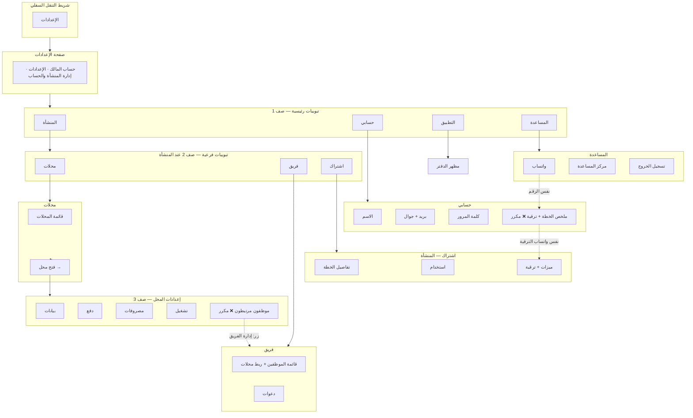
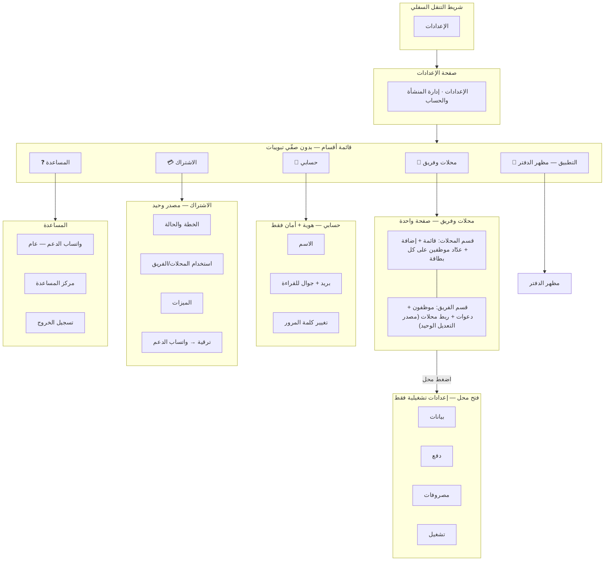
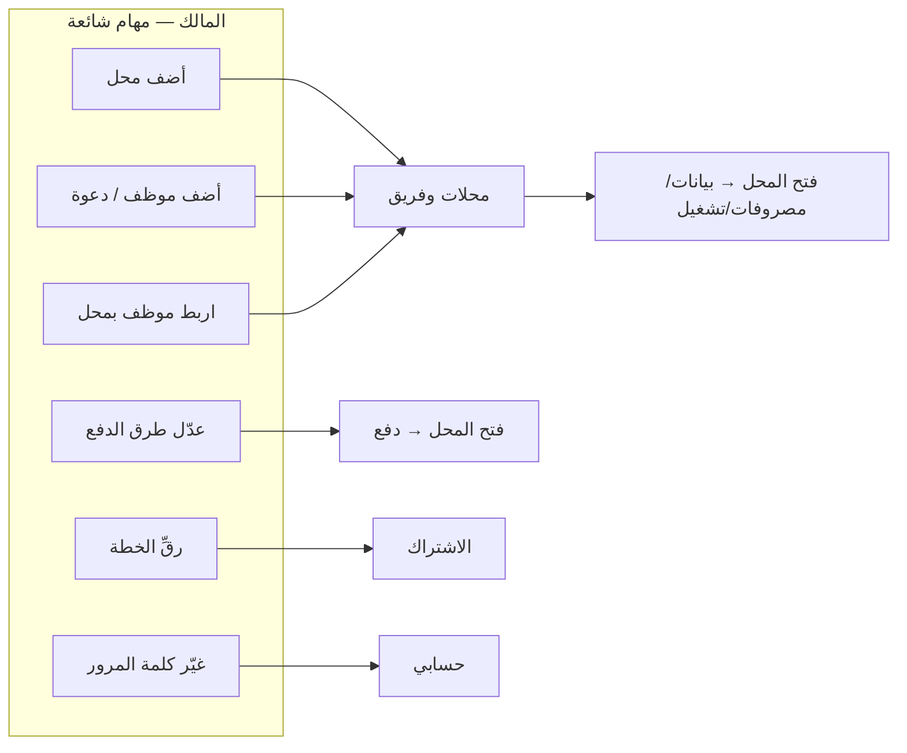
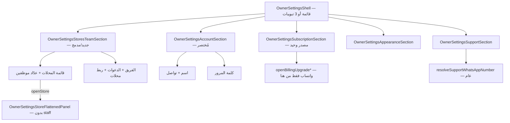

# خطة معلومات إعدادات المالك (IA) — معتمدة

> **الحالة:** معتمدة من مالك المنتج — **2026-06-19**  
> **السياق:** مراجعة UX لقسم الإعدادات بعد PRs #329–#331 (حسابي، اشتراك، دعم واتساب)  
> **التنفيذ:** دفعة واحدة — **لا نشر على `main`** إلا بطلب صريح «جاهز للايف»  
> **القيود:** احترام `docs/APPROVED_UI_BASELINE.md` — تغييرات تنظيمية (تبويبات/قوائم) بموافقة صريحة؛ لا تغيير ألوان/هوية بصرية بدون موافقة

---

## ملخص القرارات

| # | القرار |
|---|--------|
| 1 | **تقليل التبويبات** — سبب التشتت الرئيسي هو صفّان من التبويبات (4+3) |
| 2 | **دمج المحلات + الفريق** في قسم واحد «محلات وفريق» |
| 3 | **اشتراك في مكان واحد** — إزالة ملخص/ترقية الخطة من «حسابي» |
| 4 | **دعم واتساب** — مسار عام في «المساعدة»؛ ترقية الخطة من «الاشتراك» فقط |
| 5 | **حذف المكرر** داخل إعدادات المحل (موظفون مرتبطون + أزرار التحويل للفريق) |
| 6 | **تنظيف legacy** — `OwnerSettingsHomeSection` / مسار `home` إن لم يعد مستخدمًا |

---

## المخطط: الوضع الحالي (قبل)

### مشاكل الوضع الحالي

- **7 أزرار تبويب** ظاهرة دفعة واحدة تحت «المنشأة»
- **3 مستويات** عند فتح محل (رئيسي → فرعي → محل)
- **علاقة موظف↔محل** مُدارة من الفريق **ومُعرضة** من المحل (للقراءة) ثم إعادة توجيه
- **الاشتراك** في «المنشأة → اشتراك» **و** «حسابي»
- **واتساب/ترقية** من 3 مسارات

---

## المخطط: الهدف الجديد (بعد)

> **بديل مقبول إن رُفضت القائمة بالكامل:** 3 تبويبات رئيسية فقط (`منشأة` | `حسابي` | `المزيد`) — **بدون** صف فرعي.  
> «منشأة» = محلات وفريق + رابط إلى الاشتراك داخل الصفحة، أو «المزيد» = اشتراك + تطبيق + مساعدة.

---

## تدفق المستخدم (User Flow)

---

## خريطة المحتوى (Content Map)

| القسم | المحتوى | يُحذف |
|-------|---------|--------|
| **محلات وفريق** | قائمة محلات؛ إضافة/أرشفة محل؛ عدّاد `{n} موظف` على بطاقة المحل؛ قائمة فريق؛ دعوات؛ ربط موظف↔محلات؛ PIN/جوال في وضع التعديل | تبويب «فريق» المنفصل |
| **فتح محل** | بيانات، دفع، مصروفات، تشغيل (تنبيهات، ظهور السجل، مظهر دفتر المحل) | «موظفون مرتبطون»؛ زر «إدارة الفريق»؛ قائمة موظفين في «تشغيل» |
| **حسابي** | الاسم؛ بريد وجوال (قراءة)؛ تغيير كلمة المرور | `OwnerSettingsAccountPlanPanel` |
| **الاشتراك** | banner تجديد؛ الخطة؛ الاستخدام؛ الميزات؛ خطط الترقية؛ أزرار واتساب للترقية | — (يبقى هنا فقط) |
| **التطبيق** | مظهر الدفتر الافتراضي | — |
| **المساعدة** | واتساب عام؛ مركز المساعدة؛ تسجيل الخروج | — |

---

## قائمة حذف المكرر (Checklist تنفيذ)

### UI

- [ ] إزالة تبويب فرعي **«فريق»** — دمج المحتوى تحت **«محلات وفريق»**
- [ ] إزالة **`OwnerSettingsAccountPlanPanel`** من `OwnerSettingsAccountSection`
- [ ] إزالة **`OwnerSettingsStoreStaffPanel`** ومسار `staff` من overview المحل
- [ ] إزالة كتلة **«الموظفون المرتبطون»** + زر **«إدارة الفريق والصلاحيات»** من تبويب «تشغيل» في `OwnerSettingsStoreFlattenedPanel`
- [ ] إزالة **صفّي التبويبات** (4+3) → **قائمة أقسام** أو **≤3 تبويبات**
- [ ] توحيد رأس الصفحة: **«الإعدادات»** (بدون «حساب المالك» المنفصل عن «حسابي»)

### تنقل / كود

- [ ] تحديث `owner-settings-tab-navigation.js` — أقسام جديدة: `stores-team` (أو `organization`)، `subscription` كقسم مستقل
- [ ] `initialSettingsSection === "home"` → توجيه إلى `stores-team` (أو أول قسم في القائمة)
- [ ] `SettingsPageHeader onBack={() => setSection("home")}` → رجوع للقائمة الرئيسية
- [ ] تقييم إزالة **`OwnerSettingsHomeSection`** إن أصبحت القائمة الجديدة هي المدخل الوحيد
- [ ] تحديث اختبارات `owner-settings-tab-navigation.test.ts`

### ما لا يُمس

- APIs الفوترة والصلاحيات — لا تغيير عقد
- إعدادات المحل التشغيلية (دفع، مصروفات، closeoutAlert، …)
- سياسة **صفر مراجعة** للتقفيلات
- `GET /api/v1/owner/account` — يبقى لـ «حسابي»

---

## مخطط المكوّنات (Target Components)

---

## مقارنة سريعة

| المعيار | قبل | بعد |
|---------|-----|-----|
| تبويبات ظاهرة (المنشأة) | 7 | 0–1 (قائمة) |
| أماكن «الاشتراك/ترقية» | 2 | 1 |
| أماكن إدارة موظف↔محل | 2 (+ عرض في المحل) | 1 |
| عمود التنقل عند المحل | 3 مستويات | 2 (قائمة → محل) |
| حسابي | 4 بطاقات | 2 منطقيتان (هوية + أمان) |

---

## ترتيب التنفيذ المقترح (دفعة PR واحدة)

1. **هيكل القشرة** — قائمة/تبويبات جديدة + navigation
2. **دمج محلات وفريق** — `OwnerSettingsStoresTeamSection`
3. **تنظيف المحل** — حذف staff panels
4. **تنظيف حسابي** — حذف plan panel
5. **اختبارات + `pnpm check:refactor`**

---

## مراجع ملفات (الوضع الحالي)

| ملف | دور |
|-----|-----|
| `src/components/prototype-runtime/owner-settings-tabbed-shell.jsx` | القشرة الحالية — تبويبان |
| `src/components/prototype-runtime/owner-settings-tab-primitives.jsx` | تعريف التبويبات |
| `src/components/prototype-runtime/owner-settings-tab-navigation.js` | mapping section ↔ tab |
| `src/components/prototype-runtime/owner-settings-section-views.jsx` | أقسام المحتوى + تكرار الاشتراك |
| `src/components/prototype-runtime/owner-settings-store-views.jsx` | staff مكرر داخل المحل |
| `src/components/prototype-runtime/owner-settings-team-roster.jsx` | ربط محلات من الفريق |

---

## سجل الموافقة

| التاريخ | القرار |
|---------|--------|
| 2026-06-19 | تقليل التبويبات؛ دمج محلات+فريق؛ اشتراك مصدر واحد؛ حذف المكرر — **موافقة مالك المنتج** |
